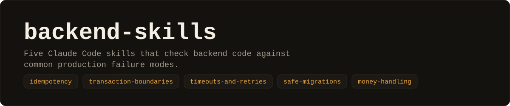
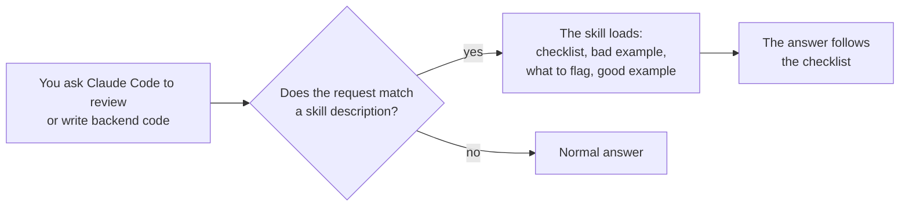

<picture>
  <source media="(prefers-color-scheme: dark)" srcset="assets/banner-dark.svg">
  <source media="(prefers-color-scheme: light)" srcset="assets/banner-light.svg">
  
</picture>

<p align="center">
  <a href="https://github.com/MatanElbaz/backend-skills/actions/workflows/lint.yml"></a>
  
  
</p>

<p align="center">
  <a href="#install">Install</a> ·
  <a href="#the-five-skills">The five skills</a> ·
  <a href="#see-one-in-action">Example</a> ·
  <a href="#how-it-works">How it works</a> ·
  <a href="#does-it-change-the-output">Does it work?</a> ·
  <a href="#faq">FAQ</a>
</p>

Each skill is a checklist plus a bad and a good example for one class of production failure. Examples are Java/Spring and PostgreSQL. You can install them as a Claude Code plugin, or copy a short rules snippet into any project.

```text
/plugin marketplace add MatanElbaz/backend-skills
/plugin install backend-skills@backend-skills
```

## Why

Duplicate deliveries, side effects that survive a rolled-back transaction, unbounded retries, locking migrations, and floating-point money all produce code that looks correct in review and fails in production. Each skill writes down what to check for one of them, with a bad example, what a reviewer should flag, and a fixed version. On the simple cases tested below the model already raised these points without help, so what this adds is an explicit checklist you can read, change, and share with a team, not new knowledge.

## Install

**As a Claude Code plugin**

```text
/plugin marketplace add MatanElbaz/backend-skills
/plugin install backend-skills@backend-skills
```

**Without the plugin**: copy [`snippets/CLAUDE.md`](snippets/CLAUDE.md) into your project's `CLAUDE.md` or `AGENTS.md`. It holds one-line versions of the rules for tools that read those files.

## The five skills

| Skill | Use it when | What it checks |
|---|---|---|
| [`idempotency`](skills/idempotency/SKILL.md) | An endpoint, webhook, consumer, or job can run more than once | Missing keys, check-then-insert races, the same key with a different payload, abandoned in-flight requests |
| [`transaction-boundaries`](skills/transaction-boundaries/SKILL.md) | Database writes sit next to HTTP calls, events, or emails | Network calls inside transactions, events published before commit or lost after it, `@Transactional` proxy and rollback traps, lost updates |
| [`timeouts-and-retries`](skills/timeouts-and-retries/SKILL.md) | Code calls anything over the network, or adds retries | Missing timeouts, unbounded or stacked retries, retrying the wrong failures, no backoff or jitter, unbounded queues |
| [`safe-migrations`](skills/safe-migrations/SKILL.md) | A migration touches a large or busy table | Index builds that block writes, whole-table updates, `SET NOT NULL` scans, constraints validated inside one transaction, in-place renames |
| [`money-handling`](skills/money-handling/SKILL.md) | Code stores, computes, or compares amounts | `float`/`double` money, missing currency, hardcoded decimals, unnamed rounding, `equals` instead of `compareTo`, splits that do not sum |

Every skill has the same shape: when to use it, a checklist, a bad example, what a reviewer should flag in it, and a good example.

## See one in action

This is the bad example from [`idempotency`](skills/idempotency/SKILL.md), and what the skill tells the reviewer to flag in it.

```java
@PostMapping("/payments")
Payment create(@RequestBody PaymentRequest req) {
    Payment p = payments.save(new Payment(req.accountId(), req.amount()));
    ledger.debit(req.accountId(), req.amount());
    return p;
}
```

- No idempotency key. If the client times out after `save` and retries, a second payment is created.
- `ledger.debit` carries no key, so a retried request can debit twice.
- A crash between `save` and `debit` leaves a payment with no debit, and a retry creates a second payment instead of finishing the first.

<details>
<summary>What the skill's good example does instead</summary>

It takes the key from the caller (`Idempotency-Key`), claims it in the database with a unique constraint before any work starts, stores a fingerprint of the request so the same key with a different payload is rejected, gives in-flight work a lease so a crashed attempt can be taken over by exactly one retry, and passes a derived key (`key + ":debit"`) to the downstream call. Read the full skill: [`skills/idempotency/SKILL.md`](skills/idempotency/SKILL.md).

</details>

## How it works

Claude Code loads a skill when your request matches its description, or when you name it (for example `backend-skills:idempotency`).



Try it by naming a skill:

```text
Review this endpoint with backend-skills:idempotency.
Check this migration against backend-skills:safe-migrations before I merge it.
```

## Does it change the output?

Not by the measure I used.

For each skill I asked the same review question about a different piece of code than the one in the skill, three times without the plugin and three times with it, and counted the runs whose answer matched a keyword regex for that skill's checklist. Each skill has a basic case and a harder one, where the code has an obvious problem plus a subtler one that the checklist covers. The exact signal, the counts, and the last output of each arm are in [`docs/demos/`](docs/demos).

<!-- results:start -->
| Skill | Without plugin | With plugin |
|---|---|---|
| `idempotency` | 3 / 3 | 2 / 3 |
| `idempotency (hard)` | 3 / 3 | 3 / 3 |
| `money-handling` | 3 / 3 | 3 / 3 |
| `money-handling (hard)` | 3 / 3 | 3 / 3 |
| `safe-migrations` | 3 / 3 | 3 / 3 |
| `safe-migrations (hard)` | 3 / 3 | 3 / 3 |
| `timeouts-and-retries` | 3 / 3 | 3 / 3 |
| `timeouts-and-retries (hard)` | 3 / 3 | 3 / 3 |
| `transaction-boundaries` | 3 / 3 | 3 / 3 |
| `transaction-boundaries (hard)` | 3 / 3 | 3 / 3 |
<!-- results:end -->

Counts are runs out of 3. On all ten cases the model raised the point every time without the plugin, including the harder ones, so this test shows no improvement. Idempotency scored lower with the plugin on the basic case (2 of 3 against 3 of 3), which is within noise at this sample size. Separately, in 8 of the 10 recorded "with" outputs the answer names the skill it applied, so the skills do get used as a review checklist. I have not measured whether that makes reviews better, so read the outputs and judge for yourself.

There are several reasons to treat this test as weak: three runs, one model, keyword matching that measures whether a point was mentioned and not whether the advice was right, and arms that differ by more than this plugin: the "without" runs disable all skills, and the "with" runs also load the other plugins installed on the machine. The recorded outputs are verbatim model output and are not fact-checked. Reproduce with `scripts/demo.sh <skill> 3` (add `hard` as a third argument for the harder case). I do not have a case where the model misses the point without the plugin, so I cannot show a benefit. What this repo offers is the written checklist, not measured uplift.

## FAQ

<details>
<summary>Does it work with tools other than Claude Code?</summary>

The plugin format is Claude Code's. The content is plain Markdown, so you can copy a skill's checklist into any tool's rules file. [`snippets/CLAUDE.md`](snippets/CLAUDE.md) is already written for `CLAUDE.md` and `AGENTS.md`.

</details>

<details>
<summary>Why Java and PostgreSQL?</summary>

Those are what the examples were written in. The checklists (claim before you act, no network calls inside a transaction, retry only what is safe to retry, take locks gently, never use floats for money) apply to other stacks. The code does not.

</details>

<details>
<summary>Can it replace a human code review?</summary>

No. These are review heuristics for common failure modes. They do not know your architecture, your traffic, or your data.

</details>

<details>
<summary>How do I add or change a skill?</summary>

Open an issue with the [skill proposal template](.github/ISSUE_TEMPLATE/skill-proposal.md). Run `python3 scripts/check_skills.py` and `python3 -m unittest discover -s tests` before sending a pull request. The linter enforces the shape described above.

</details>

## Limitations

- Examples are Java 17+ and PostgreSQL. The checklists apply elsewhere, the code does not.
- These are review heuristics, not a replacement for a review by someone who knows your system.
- The skills describe common failure modes. They do not know your architecture.
- No measured improvement. See [Does it change the output?](#does-it-change-the-output).

## Contributing

Open an issue with the [skill proposal template](.github/ISSUE_TEMPLATE/skill-proposal.md). Run `python3 scripts/check_skills.py` before sending a pull request.

## License

MIT
